# AIDTN2110 训练营

```
严航 
wylyanhang@tedu.cn
```

```0
上课时间:
	训练营：21 22 25 26 27 28
		早上：9:30-12:00
		下午：14:00-17:30
        
    正课时间：
    	早上：9:00-12:00
    	下午：14:00-18:00
    	晚自习：
```

```python
# 课程内容：
第一阶段：
	Python基础
    面向对象编程
   	Python 高级编程
第二阶段：
	Linux操作系统
    数据处理：
    网络编程：
第三阶段：
	前端：
    后端：
第四阶段：
	综合项目
    测试
第五阶段：
	方向一：数据分析
    方向二：人工智能
```

```python
# 笔记网站：
code.tarena.com.cn
用户名：tarenacode
密码：code_2013
```

```python
# 教学系统
密码：tarena
```

```python
# 教学环境安装说明
http://tedu.weimingze.com/static/python/aid_linux_virtual_env.html
    
# 百度网盘链接：
https://pan.baidu.com/s/1vT8Nga9RVgGYYn1oJPRT9A
提取码：xc70
```

## Python 语言

1. 世界编码语言排行榜：<https://www.tiobe.com/tiobe-index/>
2. Python 是一门简单优雅、免费开源、跨平台的高级编程语言。
   1. GUI开发
   2. 办公自动化
   3. web后端开发
   4. 网络爬虫
   5. 数据分析
   6. 数据挖掘
   7. 人工智能
   8. 自动化测试

相关链接：

- 官方网站：

  - <https://www.python.org/>
  - <https://www.python.org/zh-cn/3/>

- 菜鸟教程：

  - <https://www.runoob.com/python3/python3-tutorial.html>

## Python 程序的执行方式

### 1、交互式

① 打开终端：`ctrl + alt + t`

② 进入交互模式：输入 python3

③ 输入Python语句 [多次]

④ 输入exit() 或 quit() 或 ctrl + d 表示退出

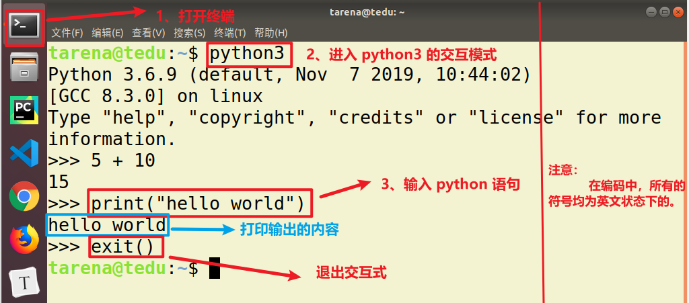

### 2、文件式

① 创建一个python 程序文件 (以 `.py` 结尾的文件)

② 向文件中书写 python 语句

③ 执行 python 程序。

​	 打开终端：在文件目录中，输入 python3 xxxx.py

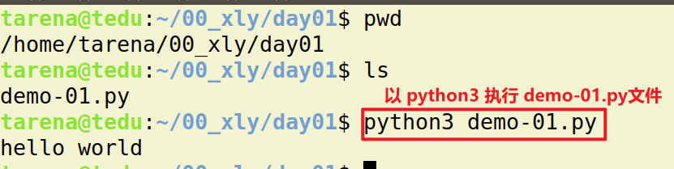

>**补充：Linux 命令**
>
>- ① mkdir  目录名 ： 创建目录。
>  ​     mkdir 00_xly 创建一个名为 00_xly 的文件夹/目录。
>- ② ls  : 查看目录下的目录以及文件
>- ③ pwd : 查看现在所在目录
>- ④ cd 目录名：进入目录中
>- ⑤ exit : 退出
>- ⑥ cat 文件名：查看文件中的内容
>- 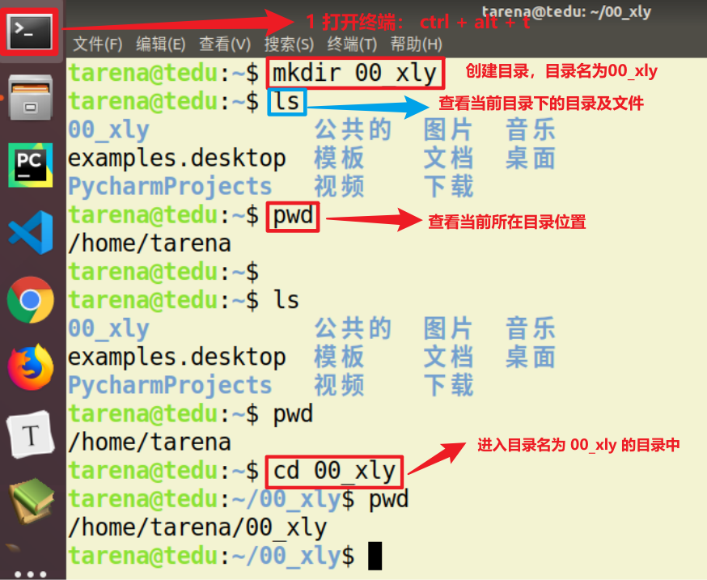
>
>任务：
>
>- 在 /home/tarena/00_xly 目录中创建 Day01 目录。
>- 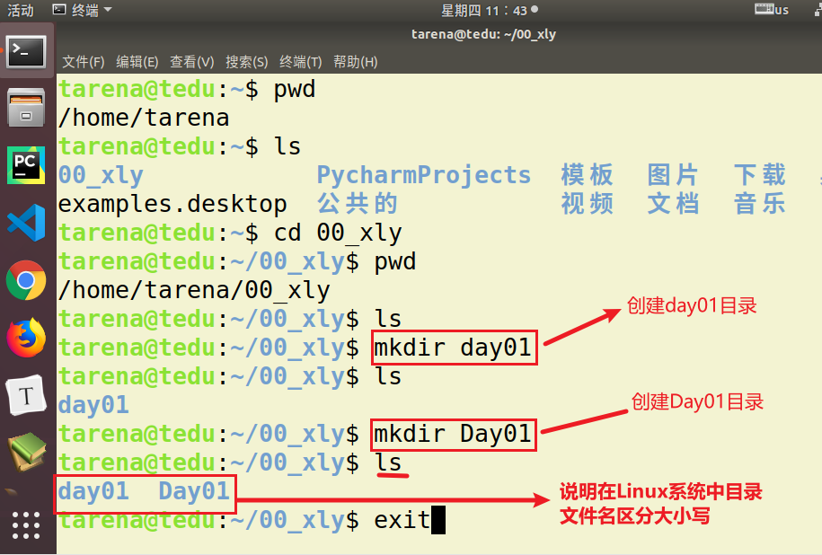
>- <font color="red"><b>在Linux操作系统中，目录及文件名区分大小写！！！</b></font>
>
>**补充：Linux 快捷键**
>
>- ① ctrl + alt + t ：打开终端
>- ② ctrl + l : 清空终端

## Pycharm 的使用

### ① 打开 Pycharm

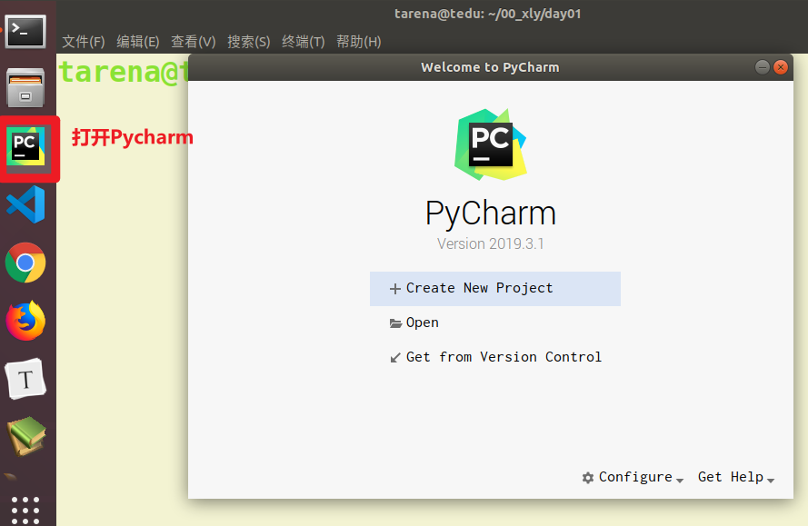

### ② 打开项目目录

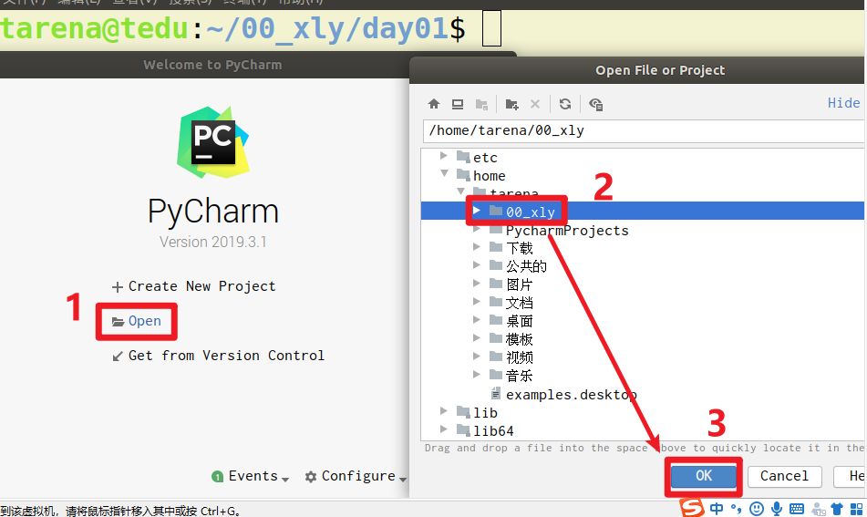

### ③ 界面说明

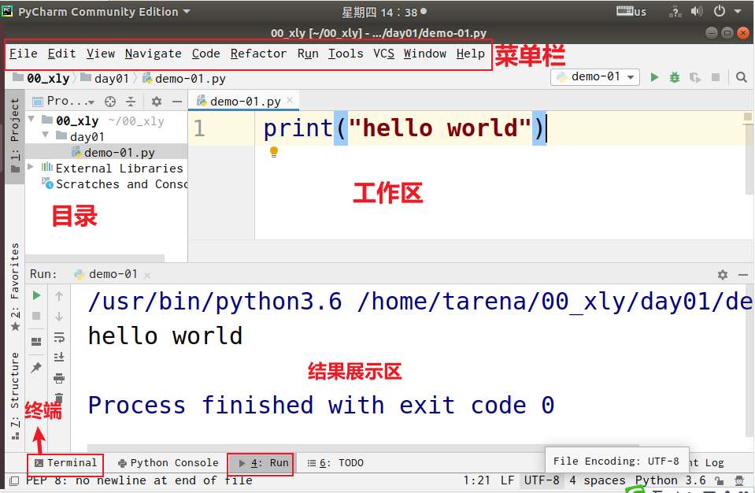

### ④ 运行文件

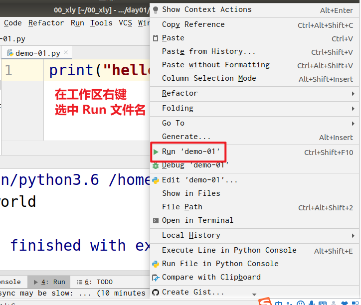

### 扩展:

#### ① 字体设置

**[file]   --> [settings] --> [Editor]  --> [font]**

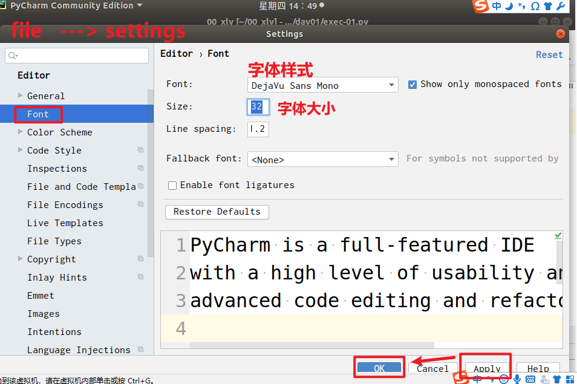

#### ② 主题设置

**[file]  ---> [settings] ---> [Editor] ---> [Color Scheme]**

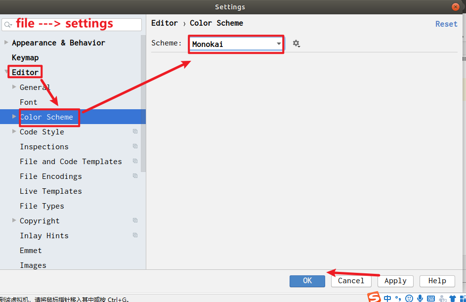

## 第一个需求


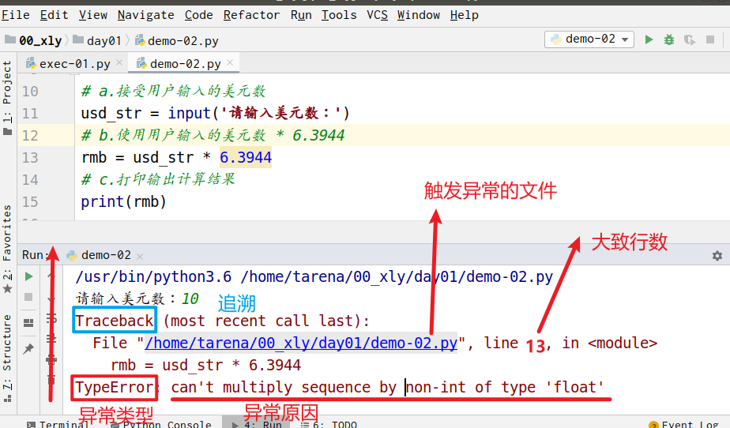

```python
# file:demo-02.py
"""
    需求： 通过python 实现汇率转换器
    步骤：
        1. 明确需求：
            a. 接受用户输入的美元数
            b. 使用 用户输入的美元数 * 6.3944
            c. 打印输出计算结果
        2. 编码、调试：
    结论：
        1. 程序不是写出来的，改出来的
        2. 码代码的过程：先分析再码
        3. 从右至左，从上之下
    编码规范： 
        ctrl + alt + l
"""
# a.接受用户输入的美元数
usd_str = input('请输入美元数：')

# b.使用用户输入的美元数 * 6.3944
usd_int = int(usd_str)
rmb = usd_int * 6.3944

# c.打印输出计算结果
print(rmb)

```

## 基础知识：

### 注释：

- 作用：用人类的语言对于代码进行解释说明，方便后期进行维护。

- 分类：

  - 单行注释：只能注释一行。 快捷键：`ctrl + /`

    ```python
    # 注释内容
    ```

  - 多行注释：可以注释多行

    ```python
    """
    	第一行注释
    	第二行注释
    	第三行注释
    """
    
    '''
    	第一行注释
    	第二行注释
    '''
    ```

  ```python
  # file: demo-03.py
  """
      单行注释与多行注释的示例演示
  """
  
  # 打印输出 hello world
  print('hello world')
  
  """
      下面三行都是输出的作用，输出内容分别是：
      Hello Python
      Hello Tedu
      Hello tarena
  """
  print("Hello Python")
  print("Hello Tedu")
  print("Hello tarena")
  ```

### 基本输出语句 print()

<font color="red">如何学好一个函数？</font>

1. 了解函数的功能。
2. 了解函数的参数。
3. 函数的返回值是什么？

- `print()` 功能：

  - 将一系列值以字符串的形式输出到标准输出设备上(默认为终端)。

- `print()` 格式：

  ```python
  print(value, ..., sep=" ", end="\n") 
  ```

- `print()` 参数：

  - value：表示需要输出的内容。
  - sep：两个或两个以上值的分隔符，默认为一个空格 " "。
  - end：输出完毕之后，会自动在末尾添加一个字符串， 默认为"\n" 表示换行。

```python
# file: demo-04.py
"""
    print(value, sep=" ", end="\n")
"""
print("hello world")

# sep 参数： 多个值之间的分隔符, 默认为 空格 " "
print("hello", "world", "!")
# sep="" 表示将多个值之间的分隔符删除
print("hello", "Python", "hello", "...", sep="")
# sep="--->" 表示将多个值之间的分隔符变为 --->
print("hello", "Python", "hello", "...", sep="--->")

print('*' * 50)
# end="\n" 输出完毕之后会自动的在末尾追加一个字符串，
#           默认为"\n" 表示换行
print("键盘敲烂", end=" ")
print("薪资过万")

# 脱单
# 不脱发
print("脱单", end=",")
print("不脱发")

```

### 基本输出函数

```python
"""
    基本输入函数
        input("提示信息")
    特点：
        1. 当程序执行到input, 等待用户输入, 输入完成之后
            才会继续向下执行
        2. 在Python中, input接收用户输入后，一般存储到变量,方便使用
        3. 在Python中, input接收用户输入的数据都当做字符串使用。
"""
print("input之前...")
name = input("请输入你的姓名：")
print("input之后...")
print(name)

# 扩展：
# type() --> 查看对象的类型
print(type(name))  
```

### 练习：

```python
"""
创建一个exec-02.py
    输出：
        您的姓名是:  xxxx
        您的年龄是:  xxxx
    输出：
        我是:xxxx, 今年：xxxx 岁。
"""

# 1. 提示用户 输入数据
name = input("您的姓名是： ")
age = input("您的年龄是： ")

# 2. 打印输出
print("我是:", name, "今年：", age, "岁。")

```


