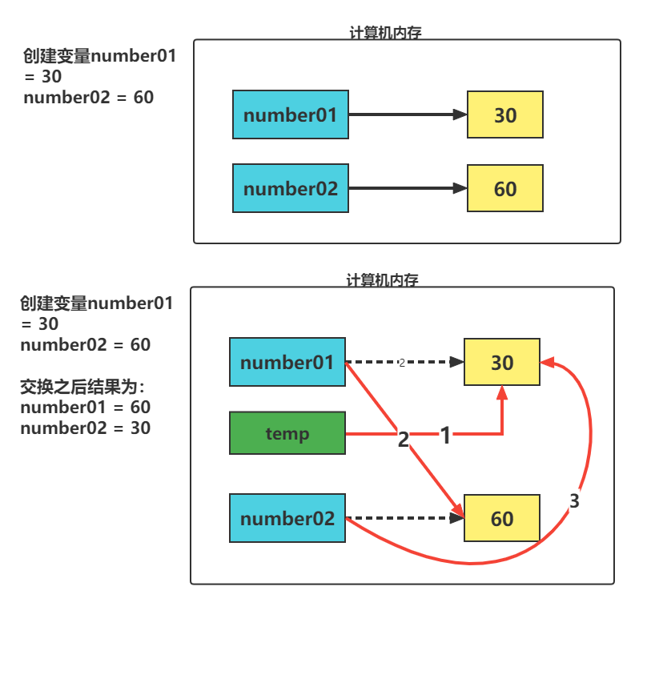

# AIDTN2110 训练营 Day02

回顾：<https://www.processon.com/view/link/61721b095653bb7318cc5bb7>

## 变量

- 关联一个对象的标识符。

- 语法：

  ```python
  变量名 = 值
  # 将右侧的值 通过赋值符号(=) 绑定在 左侧的变量名上。
  
  变量名1 = 变量名2 = 变量名3 = 值1
  ```

  ```python
  # file: demo-01.py
  """
      变量示例
          关联一个对象的标识符。
          创建一个自定义的名, 名通过=绑定了一个值(表达式),
          方便后续的使用
  """
  
  name = "张百万"
  print(name)
  
  
  # 变量名1 = 变量名2 = 变量名3 = 值1
  name1 = name2 = name3 = "严航"
  print(name1)
  print(name2)
  print(name3)
  
  # 变量修改：
  info = "人工智能大家庭"
  print(info)
  
  info = "AIDTN2110人工智能大家庭"
  print(info)
  ```

- **变量命名规范：**

  1. 由数字、字母、下划线组成

  2. 不能以数字开头

  3. 严格区分大小写

  4. 不能使用内置关键字`蓝色加粗`

     ```python
     # 查看python内置关键字
     import keyword
     print(keyword.kwlist)
     
     
     ['False', 'None', 'True', 'and', 'as', 'assert', 'break', 'class', 'continue', 'def', 'del', 'elif', 'else', 'except', 'finally', 'for', 'from', 'global', 'if', 'import', 'in', 'is', 'lambda', 'nonlocal', 'not', 'or', 'pass', 'raise', 'return', 'try', 'while', 'with', 'yield']
     ```

- **命名习惯：**

  1. 见名知义
  2. 大驼峰：每个单词首字母都大写。例如：`MyName`
  3. 小驼峰：第二个(包含)以后的单词首字母大写。例如：`myName`
  4. 下划线：每个单词之间使用 下划线 `_` 进行分割。例如：`my_name`

  ```python
  # file: demo-01.py
  age = 18
  print(age)
  
  
  myname = "严航"
  print(myname)
  # 多个英文单词之间可以这样做：
  # 1. 单词之间使用 下划线_ 进行分割
  my_name = "严航"
  print(my_name)
  
  # 2. 大驼峰: 每个单词首字母大小，例如：MyName
  MyName = "老杨"
  print(MyName)
  
  # 3. 小驼峰：第二个(含)以后的单词首字母大写 例如：myName
  myName = "老祁"
  print(myName)
  
  ```

- 作用：

  - 没有此变量时，创建一个变量，绑定关联的数据对象上
  - 变量存在时，改变此变量绑定的数据对象
  - 用变量访问此变量关联的数据对象

- 说明：

  - 使用变量前需要先赋值绑定
  - 一个变量只能绑定一个数据对象上
  - 一个对象上可以关联多个变量

- 删除变量

  - 语法：

    ```python
    del 变量名
    del 变量名1, 变量名2
    ```

  - 作用：

    - 解除变量与数据对象的关联关系

    ```python
    info = "AIDTN2110人工智能大家庭"
    print(info)
    
    # 删除变量： 删除之后 会释放内存
    #       再次访问时 会触发异常 NameError: xxx
    del info
    print(info)
    ```

- 序列赋值

  ```python
  """
      序列赋值
          假设现有变量：
              number01 = 30
              number02 = 60
          通过程序实现变量交换：
              number01 = 60
              number02 = 30
  """
  number01 = 30
  number02 = 60
  print("交换前的数字：")
  print("number01：", number01)
  print("number02：", number02)
  
  temp = number01
  number01 = number02
  number02 = temp
  print("交换后的数字：")
  print("number01：", number01)
  print("number02：", number02)
  
  ```

  
  
- 序列赋值

  ```python
  # file: demo-03.py
  """
      序列赋值
          格式：
              变量名1, 变量名2 = 值1, 值2
          说明：
              1. 变量个数必须与右侧的值的个数相同
              2. 变量名按照位置上接受对应位置上值
  """
  # 序列赋值
  num1, num2 = 100, 200
  print("num1 : ", num1, "  num2 : ", num2)
  
  # 用途：变量交换
  name01 = "张百万"
  name02 = "李四"
  print("name01: ", name01, " name02: ", name02)
  
  name01, name02 = name02, name01
  print("name01: ", name01, " name02: ", name02)
  
  ```

  ```python
  """
      变量赋值
          变量名 = 值
          变量名 = 表达式
  """
  
  score = 60 + 30
  print(score)
  
  info = "AID" + "大家庭"
  print(info)
  
  # 数据类型： 触发 TypeError
  # class_info = "AIDTN" + 10 + "大家庭"
  # print(class_info)
  ```

## 基本数据类型

### 1、字符串类型 <class 'str'>

- 只要用引号引起来的就是字符串类型。

  ```python
  # 单引号
  ''
  
  # 双引号
  ""
  
  # 三单引号
  ''''''
  
  # 三双引号
  """"""
  ```

  ```python
  # file: demo-05.py
  """
      基本数据类型
          字符串类型：
  
          type(): 查看对应的数据类型
  
  """
  # 字符串
  str01 = '单引号'
  str02 = "双引号"
  print(str01, type(str01))
  print(str02, type(str02))
  
  # 三引号：所见即所得 可以换行
  str03 = '''三
      单
          引
              号'''
  print(str03, type(str03))
  
  name = "我是：'严航'"
  name = '我是："严航"'
  print(name)
  
  # 字符串转义
  # r'' 声明原是字符串 不要将\n转换为换行 ... 
  path = r'C:\BJTT\Desktop\node\t训练营\Day02'
  print(path)
  
  ```

### 2、整型 <class 'int'>

- 不带小数点的整数，包含正自然数、0、负自然数

  ```python
  # 整型
  num1 = 10
  num2 = -20
  num3 = 30.0
  print(num1, type(num1))  # <class 'int'>
  print(num2, type(num2))  # <class 'int'>
  print(num3, type(num3))  # <class 'float'>
  
  ```

### 3、浮点型 <class 'float'>

- 带有小数部分的数，小数部分可以为0

- 表现方式：

  - 小数方式：

  - 科学计数法：

    ```python
    # 浮点型
    # 1. 小数方式
    num3 = 30.0
    print(num3, type(num3))  # <class 'float'>
    
    # 2. 科学计数法
    # 小数|整数e|E[-]指数   | 表示或   [x] x是可选
    # 作用：小数或整数乘以10的指数次方
    num4 = 3.14e5
    num4 = 3.14E-2
    print(num4, type(num4))
    
    ```

### 4、复数 `<class 'complex'>`

- 由实部和虚部组成的数
- 语法：
  - 实部系数 + 虚部系数j
  - 实部系数 + 虚部系数J

```python
# 复数
num5 = 3.4 + 5J
print(num5, type(num5))  # <class 'complex'>

```

### 4、 布尔类型

- 用来表示真和假的两种状态

- 取值：

  - `True`：表示为真。(表达式成立或满足)
  - `False`：表示为假。（表达式不成立或不满足）

- 注意：

  - `True` `False` 关键字首字母大写。

  ```python
  # 布尔型
  print(True, type(True))
  print(False, type(False))
  ```

### 5、None 空值对象

- 表示不存在的特殊关系

- 作用：

  - 占位或解除与对象的绑定关系。

  ```python
  # None 空值对象
  # 占位
  age = None
  print(age, type(age))
  age = 18
  print(age, type(age))
  # 解除绑定关系
  age = None
  print(age, type(age))
  
  ```

## 基本运算

| 符号 | 说明   |
| ---- | ------ |
| +    | 加法   |
| -    | 减法   |
| *    | 乘法   |
| /    | 除法   |
| **   | 幂运算 |
| %    | 取余   |
| //   | 地板出 |

```python
# demo-06.py
"""
    基础运算
"""
print(1 + 2)
print(1 - 2)
print(1 * 2)
print(1 / 2)

# ** 幂运算
print(2 ** 3)
# % 取余数
print(5 % 2)
# // 地板除 取商的整数部分
print(5 // 2)

# 特殊操作
# 1. 字符串 + 字符串： 表示拼接 将多个字符串进行拼接
class_info = "AIDTN2110" + "人工智能大家庭"
print(class_info)

# 2. 字符串 * 整数: 表示重复 将字符串的内容重复多次
desc = "我想涨薪！" * 3
print(desc)
```

## 类型转换

```python
# a.接受用户输入的美元数
usd_str = input('请输入美元数：')
print(usd_str, type(usd_str))

# b.使用用户输入的美元数 * 6.3944
rmb = usd_str * 6.3944

# c.打印输出计算结果
print(rmb)
```

```python
请输入美元数：10
10 <class 'str'>
Traceback (most recent call last):
  File "/home/tarena/00_xly/day02/demo-07.py", line 6, in <module>
    rmb = usd_str * 6.3944
TypeError: can't multiply sequence by non-int of type 'float'

Process finished with exit code 1

```

### float(x)

- 将数字、字符串整数或字符串浮点数转为浮点数。

- 参数：

  - x：想要转换的字符串型或浮点数。

  ```python
  """
      类型转换
  """
  
  # 1. float()
  #   int --> float
  print(float())  # 0.0
  print(float(10))  # 10.0
  
  #   str --> float
  print(float('45'), type(float('45')))  # 45.0 <class 'float'>
  print(float('4.5'), type(float('4.5')))  # 4.5 <class 'float'>
  
  # 错误写法
  # print(float(4+5j)) # 复数不能转为浮点类型
  # print(float('5A')) # 字符A不能转为浮点型
  # print(float("9-")) # -号在数字后侧不能转为浮点型
  ```

### int()

- 将数据对象转换为整数

  ```python
  # int() 将数据对象转为整型
  # str --> int
  int01 = int('-10')
  print(int01, type(int01))
  
  # int02 = int('3.1415926') # 异常 不能将.转换为整数
  # print(int02, type(int02))
  
  # float --> int
  int03 = int(3.1415926)
  print(int03, type(int03))
  
  # bool --> int
  print(int(True), type(int(True)))  # 1
  print(int(False))  # 0
  ```

### str()

- 将数据对象转换为字符串类型

```python
# str 将数据对象转换为字符串类型
print(str(10), type(str(10)))
print(str(10.0), type(str(10.0)))
print(str(4+6j), type(str(4+6j)))
print(str(True), type(str(True)))
```

### bool() 

- 去判断表达式是否成立

```python
# bool 将数据对象转为bool类型
# 以下类型转换为bool类型为假 False
print(bool(''))
print(bool(0))
print(bool(0.0))
print(bool(None))
```

## 练习

### ① 汇率转换器

```python
"""
    需求： 通过python 实现汇率转换器
"""
# 1. 获取数据
usd_str = input("请输入金额：")

# 2. 逻辑计算
usd_float = float(usd_str)
rmb = usd_float * 6.3947

# 3. 显示结果
print(rmb)
```

### ② 计算加速度

```python
"""
    计算加速度
        加速度 = (距离 - 初速度 * 时间) * 2 / 时间 ** 2
"""
# 1. 获取数据

# 2. 逻辑计算

# 3. 显示结果

```


