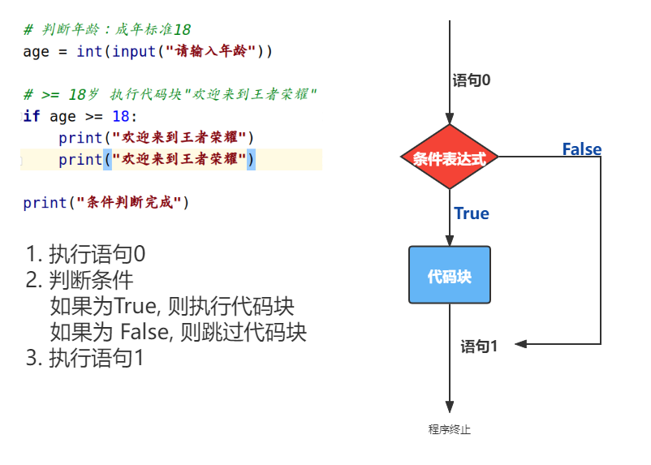
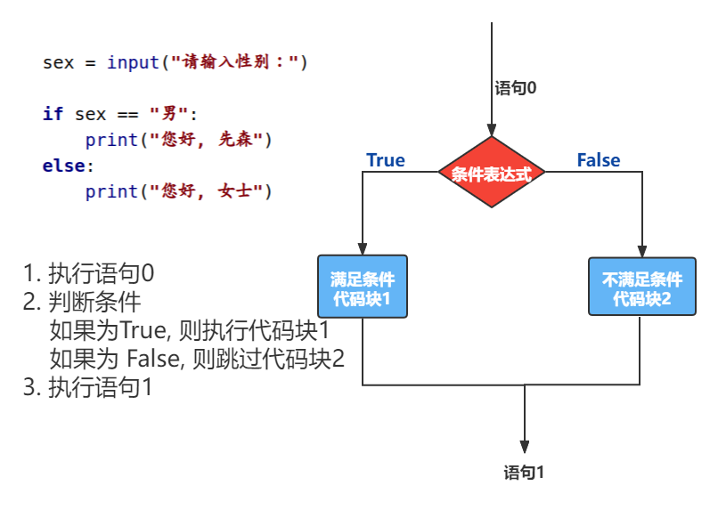

# AIDTN2110 训练营 Day03

<https://www.processon.com/view/link/61721b095653bb7318cc5bb7>

```python
"""
    1. 超市西瓜 13元/个
        问：
            拿100元 可以买几个西瓜, 找零多少?

    2. 获取用户输入的秒数, 计算是多少小时多少分钟多少秒?
"""
# 练习1： 买西瓜
# 1. 定义变量
money = 100
price = 13

# 2. 进行运算
number = 100 // 13
remain = 100 % 13
print(money, "可以购买 ", number, "个西瓜. 剩余", remain, "元")

# 练习2： 通过总秒数求小时分钟秒数
'''
    小时： 1小时 = 60 分钟
          1小时 = 60分钟 = 3600秒
    分钟： 1分钟 = 60秒
'''
# 1. 获取数据
total_seo = int(input("请输入秒数："))

# 2. 逻辑计算
hour = total_seo // 3600
minute = total_seo % 3600 // 60
second = total_seo % 60

# 3. 打印输出
print(total_seo, "秒是: ", hour, "小时", minute, "分钟", second, "秒")

```

## 增强运算符

```python
"""
    增强运算符
        +=  -=  *=  /=  **=  %=  //=
"""

x = 6
y = 10

# x += y  # x = x + y
# print(x)  # 16

x -= y  # x = x - y
print(x)  # -4
```

## 比较运算符

- 符号: `>  <   >=  <=  ==  !=`

- 用法：

  ```python
  表达式1 比较运算符 表达式2
  ```

- 返回值：

  - 布尔类型：`True(真)  False(假)`

  ```python
  """
      比较运算符
          >  >=  <  <=  ==  !=
  """
  a = 100
  b = 99
  
  print(a > b)  # True
  print(a < b)  # False
  print(a >= b)  # True
  print(a <= b)  # False
  print(a == b)  # False
  print(a != b)  # True
  
  # 注意点
  # print(10 < '10') # 字符串类型不能与整型比较
  # print(10 == '10')  # False
  
  ```

  ```python
  """
      1. 输入的是正数
      2. 输入的是月份
      3. 输入的不是偶数
  """
  # 1. 输入的是正数
  # print(int(input("请输入数字：")) > 0)
  
  # 2. 输入的是月份【1--12】
  # print(1 <= int(input("请输入月份：")) <= 12)
  
  # 3. 输入的不是偶数【被2整除】
  print(int(input("请输入数字：")) % 2 != 0)
  
  ```

## 逻辑运算符

- and   or    not

```python
"""
    逻辑运算符
        and   or   not
        表达式1 and 表达式2
        表达式1 or 表达式2
        not 表达式
"""

# and 逻辑符： 一假即假
print(True and True)  # True
print(True and False)  # False
print(False and True)  # False
print(False and False)  # False

a = 10
b = 11
print(a > b and a < b)  # False
print(a < b and a != b)  # True

# or 逻辑符: 一真即真
print(True or True)  # True
print(True or False)  # True
print(False or True)  # True
print(False or False)  # False

print(a > b or a < b)  # True
print(a < b or a != b)  # True

# not: 取反
print(not True)  # False
print(not False)  # True

# 短路运算
# 一旦结果确定，后面表达式将不再执行
# 扩展： 逻辑运算时, 尽量将复杂的(耗时的)判断放在后面
# False and ?
print(1 > 1 and input("请输入：") == "a")

# True or ?
print(3 > 1 or input("请输入") == "a")

```

```python
"""
    1. 年龄大于25岁,且身高小于170
    2. 职位是高管, 或年薪大于500000
"""

# 1. 年龄大于25岁,且身高小于170
# print(int(input("年龄：")) > 25 and int(input("身高")) < 170)

# 2. 职位是高管, 或年薪大于500000
print(input("职位:") == "高管" or int(input("年薪")) > 500000)

```

```python
"""
    判断闰年
        在终端中输入一个年份，判断是否为闰年。
        条件1：年份能被4整除，但不能被100整除。
        条件2：年份能被400整除。
"""

year = int(input("请输入一个年份"))

# 年份能被4整除，但不能被100整除。 年份能被400整除。
result = year % 4 == 0 and year % 100 != 0 or year % 400 == 0
print(result)


```

## 语句

1. 物理行：程序员编写代码的行
2. 逻辑行：Python 解释器需要执行的指令
3. 建议：一个逻辑行在一个物理上
4. 如果一个物理行中存在多个逻辑行，使用`;` 进行分割。
5. 换行:
   1. 显式换行: 通过 \ 换行, 必须在一行的末尾。
   2. 隐式换行：所有括号的内容换行，我们称之为隐式换行，()  [] {} 

```python
"""
    行
"""

# 3物理行 (一个物理行一个逻辑行) [推荐]
a = 1
b = 4
res = a < b

# 1个物理行 3个逻辑行(使用分隔号分来多条语句)
# a = 1;b = 2;res = a < b

# 显式换行
# \(续行符)： 告知解释器表示下一行是上一行末尾未结束的语句
result = 1 + 2 + \
         3 + 4 + 5 + \
         6 + 7 \
         + 8 + 9 + 10

# 隐式换行
result = (1 + 2 + 3 +
          4 + 5 + 6 + 7
          + 8 + 9 + 10)

```

## 条件判断语句 if 

- 作用：根据 条件，有选择性的执行某些语句。

- 语法结构：

  ```python
  # 第一种
  语句0
  if  条件表达式:
      符合条件表达式执行的语句块
      
  语句1
  
  # 第二种
  语句0
  if  条件表达式:
      符合条件表达式执行的语句块
  else:
      不满足条件表达式执行的语句
      
  语句1
  
  # 第三种
  语句0
  if  条件表达式:
      符合条件表达式执行的语句块
  elif  条件表达式2:
      符合条件表达式2执行的语句块
  elif  条件表达式3:
      符合条件表达式3执行的语句块    
  else:
      不满足条件表达式执行的语句
      
  语句1
  ```

  - 缩进：表示代码的结构层次。官方描述：需要四个空格。

```python
"""
    条件结构语句
"""

# 判断年龄：成年标准18
age = int(input("请输入年龄"))

# >= 18岁 执行代码块"欢迎来到王者荣耀"
if age >= 18:
    print("欢迎来到王者荣耀")
    print("欢迎来到王者荣耀")

print("条件判断完成")

```



```python
"""
    条件结构语句
"""

# 判断年龄：成年标准18
age = int(input("请输入年龄"))

# >= 18岁 执行代码块"欢迎来到王者荣耀"
if age >= 18:
    print("欢迎来到王者荣耀")
    print("欢迎来到王者荣耀")

print("条件判断完成")

# 调试模式： DEBUG
# 功能: 让程序中断，逐行执行.
# 目的：
#       1. 审查代码执行流程
#       2. 排错[发现问题，解决问题] --> 意向不到的错误
# 流程：
#       1. 添加断点：点击代码行前，出现红点
#       2. 调试模式： 右键 选择 "debug"
#       3. 逐行执行：点击 "向下" 或 F7， 逐行执行语句
#       4. ....
#       5. 结束调试：ctrl + F2

```

```python
"""
    输入性别, 如果是"男", 则打印输出 "您好, 先生"
"""

# 验证性别
# sex = input("请输入性别：")
#
# if sex == "男":
#     print("您好, 先生")
#
# print("您好, 女士")


sex = input("请输入性别：")

if sex == "男":
    print("您好, 先生")

if sex == "女":
    print("您好, 女士")

```

```python
"""
    判断性别
    if 条件表达式:
        满足条件表达式执行的代码块
    else:
        不满足条件表达式执行的代码块
"""
# sex = input("请输入性别：")
#
# if sex == "男":
#     print("您好, 先生")
#
# if sex == "女":
#     print("您好, 女士")

sex = input("请输入性别：")

if sex == "男":
    print("您好, 先森")
else:
    print("您好, 女士")

```



```python
"""
    性别校验
    if 条件表达式:
        满足条件表达式执行的代码块
    elif 条件表达式2:
        满足条件表达式2执行的代码块
    else:
        不满足条件表达式执行的代码块
"""
sex = input("请输入性别： ")

if sex == "男":
    print("您好, 先生")
elif sex == "女":
    print("您好, 女士")
else:
    print("性别有误")

```

- 说明:
  - elif 子句 可以有0个、1个或多个；
  - else 子句 可以有0个、1个，且只能放到最后。

```python
"""
    使用if-else判断实现 判断平闰年。
        在终端中输入一个年份，判断是否为闰年。
        条件1：年份能被4整除，但不能被100整除。
        条件2：年份能被400整除。

        平年则输出： 年份(获取到的年份) 是平年
        闰年则输出： 年份(获取到的年份) 是闰年
"""
year = int(input("请输入年份："))

if year % 4 == 0 and year % 100 != 0 or year % 400 == 0:
    print(year, "闰年")
else:
    print(year, "平年")

```

```python
"""
    输入一个成绩，判断该成绩属于哪个成绩等级！
        [0, 60) 属于E级
        [60, 70) 属于D级
        [70, 80) 属于C级
        [80, 90) 属于B级
        [90, 100] 属于A级
        其他属于输入错误！
"""

score = float(input("请输入成绩： "))
# [0, 60) 属于E级
if 0 <= score < 60:
    print("E级")

# [60, 70) 属于D级
elif 60 <= score < 70:
    print("D级")

# [70, 80) 属于C级
elif 70 <= score < 80:
    print("C级")

elif 80 <= score < 90:
    print("B级")

# [90, 100] 属于A级
elif 90 <= score <= 100:
    print("A级")

# 其他属于输入错误！
else:
    print("输入错误")

```

## if 语句嵌套

```python
if 条件表达式：
	满足条件表达式执行的代码块
    if 条件表达式2:
        满足条件表达式2执行的代码块
    else:
        不满足条件表达式2执行的代码块
else:
    不满足条件表达式执行的代码块
```

- 一般情况下，嵌套层数不超过3层。

```python
"""
    if 嵌套
        if 条件表达式：
            满足条件表达式执行的代码块
            if 条件表达式2:
                满足条件表达式2执行的代码块
            else:
                不满足条件表达式2执行的代码块
        else:
            不满足条件表达式执行的代码块
"""

# 上地铁：口罩
# 门口：测温
mask = input("是否戴口罩('是'或'否')：")
temp = float(input("请输入体温："))

if mask == "是":
    print("上地铁...")
    # 检测体温 35.8 -- 36.9
    if 35.8 <= temp <= 36.9:
        print('进教室...')
    else:
        print('体温检测不通过, 回家')

else:
    print('回家......')

```

```python
"""
    对于 exec-07.py 进行代码优化。
        输入一个成绩，判断该成绩属于哪个成绩等级！
            [0, 60) 属于E级
            [60, 70) 属于D级
            [70, 80) 属于C级
            [80, 90) 属于B级
            [90, 100] 属于A级
            其他属于输入错误！

        pass 语句：
            填充语法空白
"""
score = float(input("请输入成绩： "))
if 0 <= score <= 100:
    if 0 <= score < 60:
        print("E级")

    # [60, 70) 属于D级
    elif 60 <= score < 70:
        print("D级")

    # [70, 80) 属于C级
    elif 70 <= score < 80:
        print("C级")

    elif 80 <= score < 90:
        print("B级")

    # [90, 100] 属于A级
    elif 90 <= score <= 100:
        print("A级")

else:
    print("输入有误")

```

## 条件真值表达式

语法：

```python
变量名 = 值 if 条件表达式 else 值
```

注意：只适用于 `if else` 结构。

```python
"""
    条件真值表达式
        变量名 = 值 if 条件表达式 else 值2
    执行：
        先执行条件表达式：
            如果 条件表达式结果为True 则将值绑定在变量中
            否则 将 值2 绑定在变量中

"""
# 求奇数 还是 偶数
num = int(input("请输入一个数："))

# if num % 2 == 1:
#     print("奇数")
# else:
#     print("偶数")

# 将上方的代码修改为 条件表达式
res = "奇数" if num % 2 == 1 else "偶数"
print(res)

```

```python
"""
    模拟出租车计价器
        1. 起步价: 13元包含3公里.
        2. 超过3公里, 但是没有超过15公里: 每公里2.3元.
        3. 如果超过15公里: 每公里加收2.3元的50%.
        要求：计算的最终费用 保留两位小数.
"""
```


