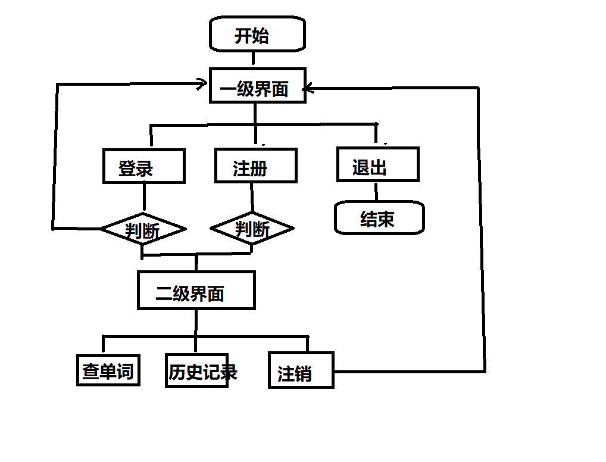

## 《在线词典》项目详细设计文档

```
作者 ：Levi
时间 ：2021-12-21
```


### 架构设计

C/S 架构，采用MVC 设计模式

```
 client            Server          DB_server
+------+  TCP    +---------+       +-------+
| View | <-----> | Control | <---> | Model |
+------+         +---------+       +_______+
                                     MySQL
```




### 通信协议设计

通信过程采用字节码形式进行通信，其中各个字段的内容用制表符"\t" 进行分隔。

发送给服务器的数据包用的第一个字节为类型码，后跟其他数据

服务器返回给客户端的数据包第一个字节代表成功或失败b'T'代表成功，b'F'代表失败

1. 用户注册

   - 发送

   | 类型码 | 用户名  | 密码    |
   | :----: | ------- | ------- |
   | `b'R'` | b'xxxx' | b'yyyy' |

   - 接收

   | 返回结果码 |
   | --------- |
   | b'T' 成功  |
   | b'F' 失败  |
   
2. 用户登录
   - 发送

   | 类型码 | 用户名  | 密码    |
   | :----- | ------- | ------- |
   | `b'L'` | b'xxxx' | b'yyyy' |

   - 接收

   | 返回结果码 |
   | --------- |
   | b'T' 成功  |
   | b'F' 失败  |


3. 查询单词
   - 发送

   | 类型码 | 查询单词 |
   | :----- | -------- |
   | `b'Q'` | b'word'  |

   

   - 接收

   | 返回结果码 | 单词解释                   |
   | :--------: | -------------------------- |
   | b'T' 成功  | 解释内容的字节串(UTF8编码) |
   | b'F' 失败  | 无                         |


4. 查询历史
   - 发送

   | 类型码 |
   | :----- |
   | `b'H'` |

   - 接收

   | 返回结果码 | 历史记录                                                     |
   | ----------------- | ------------------------ |
   | b'T' 成功  | 单词的历史记录（最多10条），每条记录用`b';'`分隔，每条记录中用逗号(`b','`) 分隔用户名，单词和时间 |
   | b'F' 失败  | 无                                                           |

5. 退出登录
   - 发送

   | 类型码 |
   | :----- |
   | `b'E'` |

   - 接收
   
     无


### 数据库设计

- 数据库名称: `dict`

  ```mysql
  CREATE DATABASE dict DEFAULT CHARSET utf8;
  ```

- 数据表

  1. `words` 数据表用于存储 单词数据
  2. `user`数据表用于存储 用户信息
  3. `hist`数据表用于存储 存储用户的历史记录

- `words` 数据表的设计

| | id   | 单词 | 解释 |
| ---- | ---- | ---- | ---- |
| 字段名 | id | word | mean |
| 字段类型 | Int(11) | varchar(32) | varchar(1024) |
| 限制 | 主键唯一自增 |  |  |

SQL语句

```
create table words (
id int primary key auto_increment,
word varchar(32),
mean varchar(1024)
);
```


- `user`数据表的设计

| | id   | 用户名 | 密码 |
| ---- | ---- | ---- | ---- |
| 字段名 | id | name | password |
| 字段类型 | Int(11) | varchar(32) | char(64) |
| 限制 | 主键唯一自增 | 唯一 |  |

SQL语句

```
create table user (
id int primary key auto_increment,
name varchar(32) unique,
password char(64)
);

```


- `hist`数据表的设计

| | id   | 用户id | 单词id | 查询时间 |
| ---- | ---- | ---- | ---- | ---- |
| 字段名 | id | user_id | words_id | time |
| 字段类型 | Int(11) | Int(11) | Int(11) | DATETIME |
| 限制 | 主键唯一自增 | 外键关联user | 外键关联words | 默认当前时间 |

SQL语句

```
create table hist (
id int primary key auto_increment,
user_id int,
words_id int,
time DATETIME DEFAULT now(),
foreign key(user_id) references user(id) 
on delete cascade on update cascade,
foreign key(words_id) references words(id)
);

```


